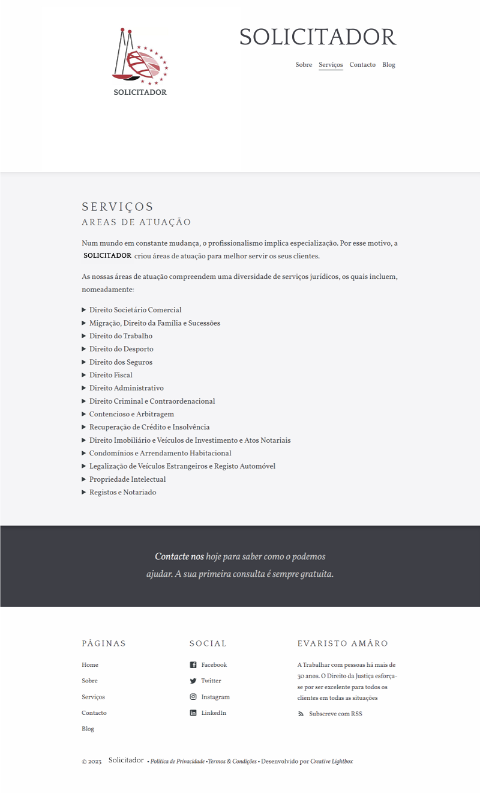

# Solicitador

Solicitador é um website dirigido para Advogados e Solicitadores.

## Design

Abaixo está uma amostra da página de serviços.



## Stack

Construído com Next.js e Markdown

<p align="right">(<a href="#readme-top">voltar ao topo</a>)</p>

## Funcionalidades

- Formulário de contato
- Página inicial
- Página do blog
- Página sobre
- Página de serviços
- Página de contato
- Formulário de contato
- Componentes pré-estilizados
- Páginas de categorias de postagens
- Comentários Disqus para postagens
- Sistema de funcionários e autores
- Rodapé configurável
- Otimizado para edição no [CloudCannon](https://cloudcannon.com/)
- Feed RSS/Atom
- Tags SEO
- Google Analytics

<p align="right">(<a href="#readme-top">voltar ao topo</a>)</p>

## Configuração

1. Adicione os detalhes do seu site e autor em `content/data/seo.json`.
2. Adicione suas chaves do Google Analytics e Disqus em `content/data/site.json`.
3. Inicie um fluxo de trabalho para ver a saída do seu site (com o [CloudCannon](https://app.cloudcannon.com/) ou localmente com Next.js).

## Desenvolvimento

Solicitador é construído com [Next.js](https://nextjs.org/) (versão `13.0.4`).

<p align="right">(<a href="#readme-top">voltar ao topo</a>)</p>

## Instalação

```bash
npm install
```

```bash
npm start
```

ou

```bash
npm run dev
```

Abra [http://localhost:3000](http://localhost:3000) com seu navegador para ver o resultado.

<p align="right">(<a href="#readme-top">voltar ao topo</a>)</p>

## Edição

O Solicitor já está otimizado para adicionar, atualizar e remover páginas, funcionários, postagens, detalhes da empresa e elementos do rodapé no CloudCannon.

### Postagens

- Adicione, atualize ou remova uma postagem na coleção Postagens.
- O campo Autor do Funcionário faz a ligação com membros na coleção Funcionários.
- Altere as predefinições quando novas postagens são criadas em `content/posts/_defaults.md`.

### Formulário de Contato

- Pré-configurado para funcionar com CloudCannon.
- Envia e-mail para o endereço listado nos detalhes da empresa.

<p align="right">(<a href="#readme-top">voltar ao topo</a>)</p>

### Funcionários

- Reutilizado em todo o site para economizar em vários locais de edição.

### Rodapé

- Exposto como um arquivo de dados para dar melhor acesso aos clientes.
- Configurado na seção Data / Rodapé.

### Detalhes da Empresa

- Reutilizado em todo o site para economizar em vários locais de edição.
- Configurado na seção Data / Empresa.

<p align="right">(<a href="#readme-top">voltar ao topo</a>)</p>

## Licença

Distribuído sob a Licença MIT. Consulte `LICENSE.txt` para obter mais informações.

## Contato

José Horta Calvário - @josh_hortt

Meu E-mail - joshhortt@yahoo.com

<p align="right">(<a href="#readme-top">voltar ao topo</a>)</p>
